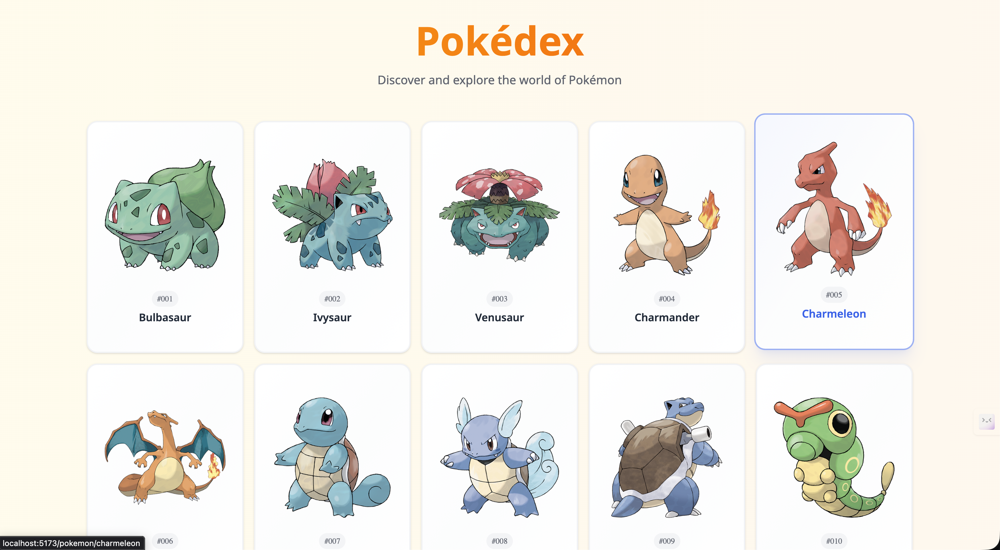

# 🎮 Pokédex - Modern React Pokémon Explorer

A beautiful, responsive Pokédex application built with React, TypeScript, and modern web technologies. Explore the world of Pokémon with smooth animations, infinite scrolling, and detailed Pokémon information.

[Live Link](https://pokedex-rho-drab.vercel.app/)



## ✨ Current Features

### 🎯 Core Functionality

- **Complete Pokémon Database**: Browse all Pokémon with data from the official PokéAPI
- **Infinite Scroll**: Seamlessly load more Pokémon as you scroll down
- **Detailed Pokémon Pages**: View comprehensive stats, abilities, types, and evolution chains
- **Responsive Design**: Optimized for desktop, tablet, and mobile devices

### 🎨 User Experience

- **Smooth Animations**: Powered by Framer Motion for delightful interactions
- **Beautiful UI**: Modern design with Pokemon-themed colors (amber/orange/red palette)
- **Loading States**: Elegant skeletons and loading indicators
- **Error Handling**: Graceful fallbacks with friendly error messages
- **Fallback Images**: Beautiful placeholder images when Pokémon images fail to load

### ⚡ Performance Optimizations

- **React Query**: Intelligent caching and background updates
- **Parallel Image Loading**: Efficient image fetching with useQueries
- **Intersection Observer**: Optimized infinite scroll implementation
- **Staggered Animations**: Prevent animation overload with intelligent grouping
- **Memoized Components**: Reduced re-renders with React.memo optimization

## 🎨 Design Philosophy & Trade-offs

### Design Decisions Made

- **Pokemon-themed Color Palette**: Chose warm amber/orange/red gradients to evoke the classic Pokemon aesthetic rather than generic blue/purple schemes
- **Card-based Layout**: Opted for a grid of cards over list view to showcase Pokemon images prominently
- **Infinite Scroll**: Chose infinite scroll over pagination for a more modern, social media-like browsing experience
- **Fallback Images**: Created custom fallback images instead of broken image icons for better UX

### Performance Trade-offs

- **Parallel Image Loading**: Load all Pokemon images in parallel for instant display, trading initial load time for better perceived performance
- **Animation Staggering**: Limited stagger animations to groups of 25 to prevent overwhelming delays on large datasets
- **React Query Caching**: Aggressive caching (5-10 minutes) to reduce API calls, accepting slightly stale data for better performance

### Things I'd Improve with More Time

- **Search Functionality**: Implement real-time search with debounced input and filtering capabilities
- **Virtual Scrolling**: Implement windowing for handling 1000+ Pokemon without DOM performance issues
- **Image Optimization**: Add WebP support, lazy loading, and progressive image enhancement
- **Dark Mode**: Complete the theme system with proper dark/light mode toggle and persistence
- **Better Error Boundaries**: Implement granular error boundaries for different app sections
- **Accessibility**: Add comprehensive ARIA labels, keyboard navigation, and screen reader support
- **Advanced Caching**: Implement service workers for offline functionality and background sync
- **Animation Performance**: Use CSS transforms and will-change properties for better 60fps animations
- **Bundle Optimization**: Code splitting by routes and lazy loading of non-critical components

### 🛠️ Technical Features

- **TypeScript**: Full type safety throughout the application
- **Modern React**: Built with React 19 and latest React patterns
- **Tailwind CSS**: Utility-first CSS framework for rapid development
- **Shadcn/ui**: Beautiful, accessible component library
- **React Router**: Client-side routing for seamless navigation
- **ESLint**: Code quality and consistency enforcement

## 🚀 Getting Started

### Prerequisites

- Node.js 18+
- pnpm (recommended) or npm

### Installation & Running

```bash
# Clone the repository
git clone https://github.com/Syammed2429/Pokedex.git
cd Pokedex

# Using pnpm (recommended)
pnpm install
pnpm dev

# OR using npm
npm install
npm run dev

# Build for production
pnpm build  # or npm run build
```

Open [http://localhost:5173](http://localhost:5173) to view the app in your browser.

## 🎯 Future Feature Ideas

_If time permits, here are some exciting features that could enhance the Pokédex:_

### 🔍 Enhanced Search & Filtering

- **Real-time Search**: Search Pokémon by name with debounced input for smooth performance
- **Advanced Filters**: Filter by type, generation, region, height, weight, stats
- **Type Effectiveness Calculator**: Show type matchups and effectiveness charts
- **Favorites System**: Save and organize your favorite Pokémon
- **Recently Viewed**: Quick access to recently explored Pokémon

### 📊 Data Visualization

- **Stats Comparison**: Side-by-side Pokémon stat comparisons
- **Evolution Trees**: Interactive evolution chain visualizations
- **Type Distribution Charts**: Visual breakdown of Pokémon types
- **Regional Pokédexes**: Browse Pokémon by specific regions

### 🎮 Interactive Features

- **Pokémon Team Builder**: Create and save custom teams
- **Random Pokémon Generator**: Discover new Pokémon with surprise button
- **Pokémon Quiz**: Test your knowledge with interactive quizzes
- **Move Calculator**: Damage calculations and move effectiveness

### 📱 Enhanced Mobile Experience

- **PWA Support**: Install as a mobile app with offline capabilities
- **Touch Gestures**: Swipe navigation between Pokémon
- **Voice Search**: Search Pokémon using voice commands
- **Haptic Feedback**: Enhanced mobile interactions

### 🌟 Visual Enhancements

- **3D Pokémon Models**: Interactive 3D representations
- **Animated Sprites**: Movement animations from the games
- **Sound Effects**: Audio from Pokémon games
- **Custom Themes**: Multiple color schemes beyond the current Pokemon theme

### 🗄️ Data Management

- **Offline Mode**: Browse cached Pokémon without internet
- **Export Features**: Export Pokémon data to CSV/JSON
- **Bookmarking**: Save specific Pokémon searches and filters
- **User Profiles**: Personal progress and statistics tracking

### 🔧 Technical Improvements

- **Virtual Scrolling**: Handle thousands of Pokémon efficiently
- **Service Workers**: Background sync and offline capabilities
- **GraphQL Integration**: More efficient data fetching
- **Real-time Updates**: Live data synchronization

## 🏗️ Project Structure

```
src/
├── components/          # Reusable UI components
│   ├── pokemon/        # Pokémon-specific components
│   ├── ui/             # Shadcn/ui components
│   └── ...
├── container/          # Page-level containers
├── hooks/              # Custom React hooks
├── lib/                # Utility functions and providers
├── services/           # API integration
├── types/              # TypeScript type definitions
├── motion-variants/    # Animation configurations
└── skeletons/          # Loading state components
```

## 🛠️ Built With

- **React 19** - Latest React with concurrent features
- **TypeScript** - Type-safe JavaScript
- **Vite** - Fast build tool and dev server
- **Tailwind CSS** - Utility-first CSS framework
- **Framer Motion** - Animation library
- **TanStack Query** - Data fetching and caching
- **React Router** - Client-side routing
- **Axios** - HTTP client
- **Shadcn/ui** - Component library
- **Lucide React** - Icon library

## 📋 API Reference

This project uses the [PokéAPI](https://pokeapi.co/) for all Pokémon data:

- Free and open-source
- No authentication required
- Comprehensive Pokémon database
- RESTful API with JSON responses

## 🤝 Contributing

Contributions are welcome! Whether it's:

- 🐛 Bug fixes
- ✨ New features
- 📚 Documentation improvements
- 🎨 UI/UX enhancements

## 📄 License

This project is open source and available under the MIT License.

## 🙏 Acknowledgments

- **PokéAPI** - For providing the comprehensive Pokémon database
- **The Pokémon Company** - For creating the amazing world of Pokémon
- **React Community** - For the incredible ecosystem and tools
- **Shadcn** - For the beautiful component library

---

_Built with ❤️ for Pokémon fans around the world!_

You can also install [eslint-plugin-react-x](https://github.com/Rel1cx/eslint-react/tree/main/packages/plugins/eslint-plugin-react-x) and [eslint-plugin-react-dom](https://github.com/Rel1cx/eslint-react/tree/main/packages/plugins/eslint-plugin-react-dom) for React-specific lint rules:

```js
// eslint.config.js
import reactX from "eslint-plugin-react-x";
import reactDom from "eslint-plugin-react-dom";

export default defineConfig([
  globalIgnores(["dist"]),
  {
    files: ["**/*.{ts,tsx}"],
    extends: [
      // Other configs...
      // Enable lint rules for React
      reactX.configs["recommended-typescript"],
      // Enable lint rules for React DOM
      reactDom.configs.recommended,
    ],
    languageOptions: {
      parserOptions: {
        project: ["./tsconfig.node.json", "./tsconfig.app.json"],
        tsconfigRootDir: import.meta.dirname,
      },
      // other options...
    },
  },
]);
```
